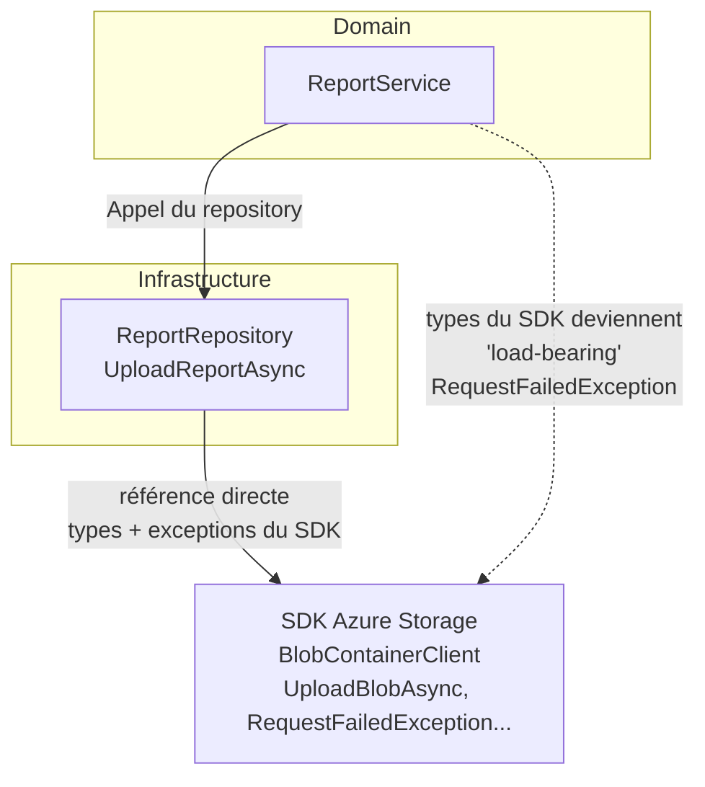
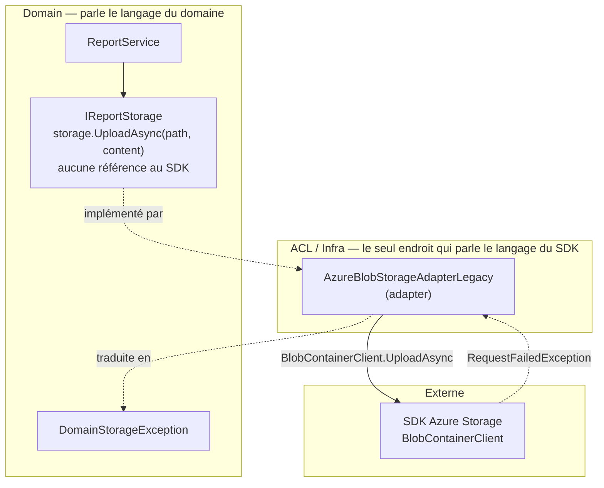
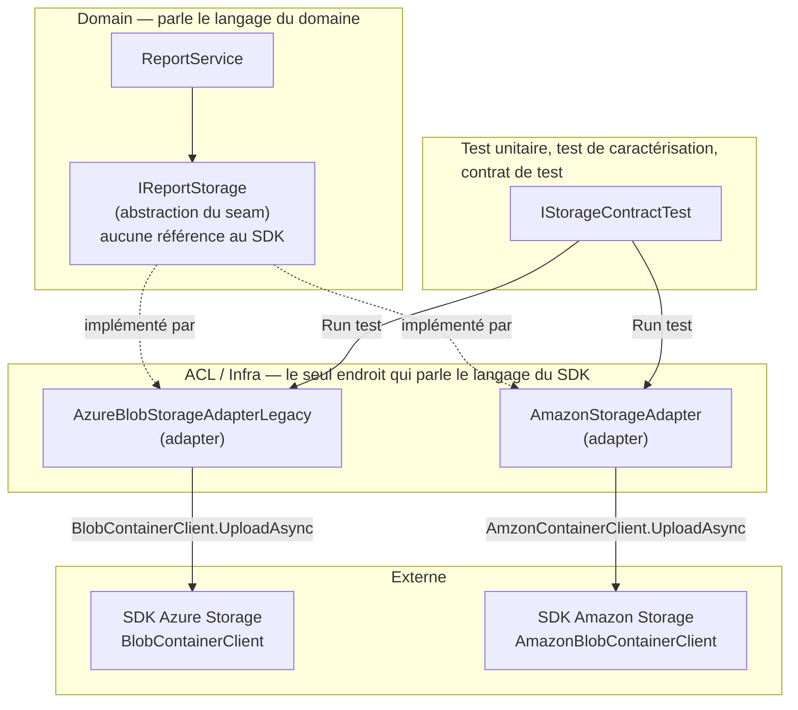
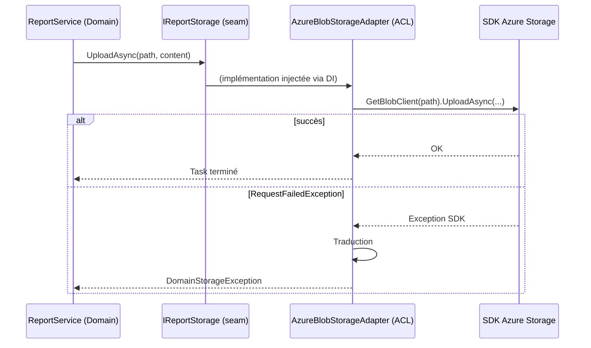

# Migration 

## Le problème : la dépendance qui "fuit" dans le domaine

```mermaid
flowchart TB
    subgraph domain["Domain"]
        RS["ReportService"]
    end

    subgraph Infra["Infrastructure"]
        Repository
    end

    Repository["ReportRepository<br/>UploadReportAsync"]

    SDK["SDK Azure Storage<br/>BlobContainerClient<br/>UploadBlobAsync, RequestFailedException..."]

    RS -->|"Appel du repository"| Repository
    Repository -->|"référence directe<br/>types + exceptions du SDK"| SDK
    RS -.->|"types du SDK deviennent<br/>'load-bearing'<br/>RequestFailedException"| SDK
```
## La solution : la couche anti corruption
### Etape 1

```mermaid
    flowchart TB
    subgraph domain["Domain — parle le langage du domaine"]
        RS["ReportService"]
        IRS["IReportStorage<br/>storage.UploadAsync(path, content)<br/>aucune référence au SDK"]
        DSE["DomainStorageException"]
    end

    subgraph acl["ACL / Infra — le seul endroit qui parle le langage du SDK"]
        ADP["AzureBlobStorageAdapterLegacy<br/>(adapter)"]
    end

    subgraph ext["Externe"]
        SDK["SDK Azure Storage<br/>BlobContainerClient"]
    end

    RS --> IRS
    IRS -.->|"implémenté par"| ADP
    ADP -->|"BlobContainerClient.UploadAsync"| SDK
    SDK -.->|"RequestFailedException"| ADP
    ADP -.->|"traduite en"| DSE
```

### Etape 2

```mermaid
    flowchart TB
    subgraph domain["Domain — parle le langage du domaine"]
        RS["ReportService"]
        IRS["IReportStorage<br/>(abstraction du seam)<br/>aucune référence au SDK"]
    end

    subgraph acl["ACL / Infra — le seul endroit qui parle le langage du SDK"]
        ADP["AzureBlobStorageAdapterLegacy<br/>(adapter)"]
        SNI["AmazonStorageAdapter<br/>(adapter)"]
    end


    subgraph Test["Test unitaire, test de caractérisation,<br>contrat de test"]
        IStorageContractTest
    end

    subgraph ext["Externe"]
        SDK["SDK Azure Storage<br/>BlobContainerClient"]
        SDKA["SDK Amazon Storage<br/>AmazonBlobContainerClient"]
    end

    RS -->IRS
    IRS -.->|"implémenté par"| ADP
    IRS -.->|"implémenté par"| SNI
    ADP -->|"BlobContainerClient.UploadAsync"| SDK
    SNI -->|"AmzonContainerClient.UploadAsync"| SDKA

    IStorageContractTest -->|"Run test"| ADP
    IStorageContractTest -->|"Run test"| SNI

```

### autre vue, diagramme de séquence

```mermaid
sequenceDiagram
    participant RS as ReportService (Domain)
    participant I as IReportStorage (seam)
    participant A as AzureBlobStorageAdapter (ACL)
    participant S as SDK Azure Storage

    RS->>I: UploadAsync(path, content)
    I->>A: (implémentation injectée via DI)
    A->>S: GetBlobClient(path).UploadAsync(...)
    alt succès
        S-->>A: OK
        A-->>RS: Task terminé
    else RequestFailedException
        S-->>A: Exception SDK
        A->>A: Traduction
        A-->>RS: DomainStorageException
    end
```